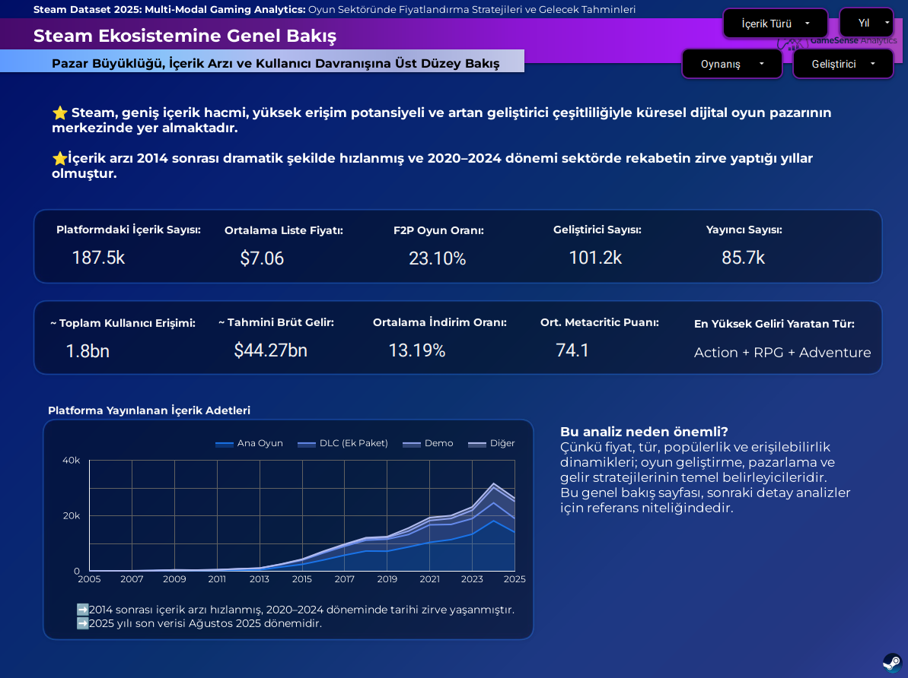
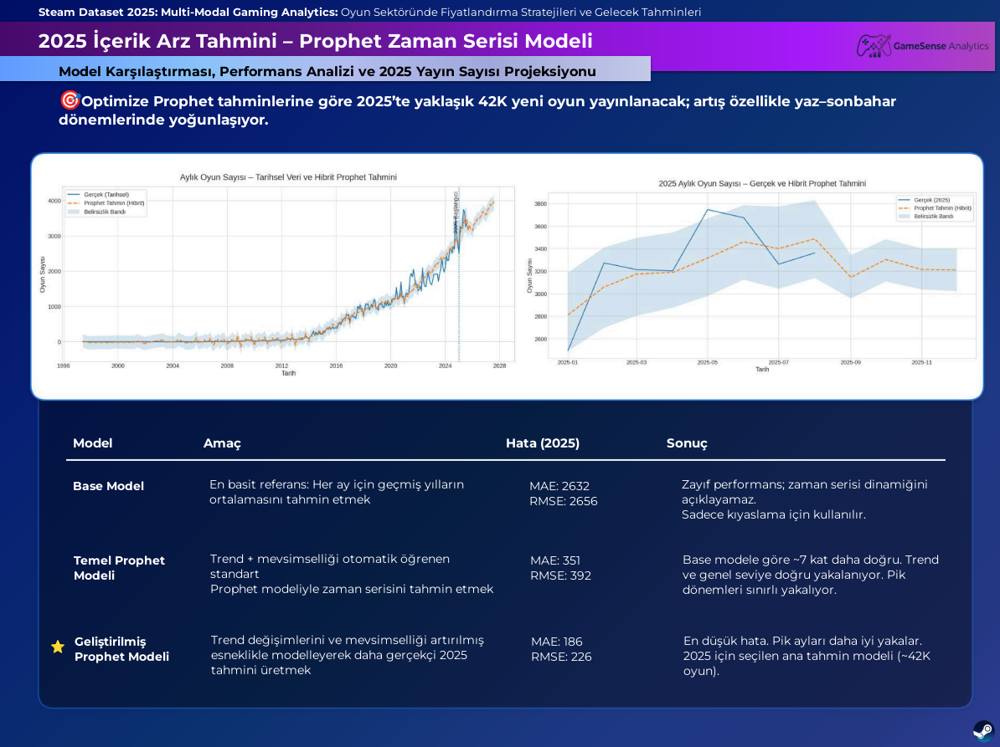
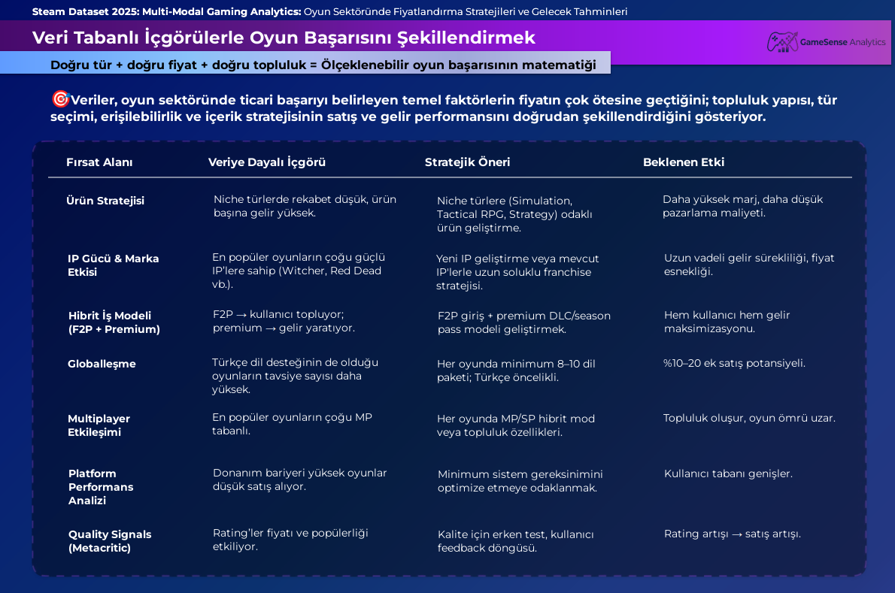

# 🎮 Steam Market Analytics & Price Prediction 2025


## 📌 Executive Summary
Bu proje, **240.000'den fazla oyun verisi** barındıran Steam 2025 veri seti üzerinde gerçekleştirilmiş uçtan uca (End-to-End) bir veri analizi çalışmasıdır. 

**Temel Amacımız:** Oyun pazarındaki büyüme trendlerini (Time Series Forecasting) anlamak ve oyunların teknik/kategorik özelliklerinden yola çıkarak optimum piyasa fiyatını tahmin eden (Regression) makine öğrenmesi modelleri geliştirmektir.


---

## 🛠️ Tech Stack

### 1. Veri Mühendisliği & Modelleme
- **Google BigQuery:** Ham ve işlenmiş verilerin tutulduğu merkezi Veri Ambarı.
- **dbt Cloud:** Veri dönüştürme ve modelleme (Staging → Intermediate → Mart).

### 2. Makine Öğrenmesi & Veri Bilimi
- **Zaman Serisi Analizi:** Meta Prophet (`01_pazar_buyume_tahmini.ipynb`) kullanılarak pazarın büyüme trendi modellenmiştir.
- **Regresyon Modelleri:** XGBoost ve Random Forest Regressor (`02_fiyat_tahmin_modeli.ipynb`) algoritmaları ile oyun özellikleri (sistem gereksinimleri, tür, yayıncı vb.) üzerinden fiyat tahmini gerçekleştirilmiştir.

### 3. İş Zekası (BI) & Dashboard
- **Looker Studio:** [Canlı Dashboard](https://lookerstudio.google.com/reporting/14eafbaa-cbb1-4a15-baf2-8e5f128a12e3) üzerinden dinamik analiz sunumu.


---

## 📊 Key Insights

### 1. Oyun Sektöründe Enflasyonist Trend
- **Bulgu:** 2021 yılında $8.28 olan ortalama oyun fiyatının, model projeksiyonlarına göre 2025'te **$10.15** seviyesine çıkacağı tahmin edildi.

### 2. Donanım Gereksinimlerinin Fiyata Etkisi (Feature Importance)
- **Bulgu:** XGBoost modelimizin özellik önem (feature importance) çıktılarında, "Sistem Gereksinimleri" en güçlü belirleyici çıktı. Yüksek donanım isteyen oyunlar, pazar ortalamasından **~%60 daha yüksek** fiyatlandırılmaktadır.
- **Veri Bilimi Yaklaşımı:** Teknik kapasite (grafik kalitesi/işlemci yükü), doğrudan üretim maliyetine işaret ettiği için regresyon modellerinde hedefin varyansını açıklamada çarpıcı bir paya sahiptir.

### 3. Fiyat ve Beğeni Arasındaki Zayıf Korelasyon
- **Bulgu:** Veri üzerinde yapılan EDA kapsamında, Fiyat ile Metacritic skoru arasındaki korelasyon **r = 0.23 (Zayıf Pozitif)** olarak ölçüldü.
- **İş Yaklaşımı:** Yüksek etiket fiyatı, kalite ve beğeni garantisi sunmamaktadır. Stüdyolar, satış stratejilerini belirlerken sadece yüksek fiyatlandırmaya değil, optimizasyona da (bug-free gameplay) bütçe ayırmalıdır.

### 4. Pazar Doygunluğu ve Görünürlük (Discoverability)
- **Bulgu:** Prophet zaman serisi modeli, yıllara göre pazara giren oyun sayısında **üstel (exponential) büyüme** tespit etmiştir.




---

## 📂 Dosya Yapısı ve Çoğaltılabilirlik

Projenin github deposu düzeni şu şekildedir:

```text
├── 01_pazar_buyume_tahmini.ipynb    # Prophet ile zaman serisi tahmini (Pazar Trendi)
├── 02_fiyat_tahmin_modeli.ipynb     # XGBoost & Random Forest ile oyun fiyatı regresyonu
├── 03_steam_pazar_analizi_sunumu.pdf# Detaylı iş analizi iş vizyonu sonuç raporu
├── Steam-DBT/                       # dbt projeleri (Staging, Intermediate, Mart modelleri)
└── archive/                         # EDA ve ilk iterasyon aşamalarındaki Notebook'lar
```

Hızlı genel bakış için aşağıdaki harici kaynakları kullanabilirsiniz:
- 🗺️ [Veri Mimarisi (tldraw) Diyagramı](https://www.tldraw.com/f/A1G0ucpf2pwONYo6cEshK?d=v-660.343.2143.1220.page)
- 📊 [Canlı Dashboard (Looker Studio)](https://lookerstudio.google.com/reporting/14eafbaa-cbb1-4a15-baf2-8e5f128a12e3)

---
*Bu proje Workintech Data Science Bootcamp kapsamında geliştirilmiştir.*
